### Hi there 👋

<picture>
  <source srcset="./profile/stats_dark.svg" media="(prefers-color-scheme: dark)" />
  <source srcset="./profile/stats_light.svg" media="(prefers-color-scheme: light), (prefers-color-scheme: no-preference)" />
  
</picture>

<picture>
  <source srcset="./profile/top-langs_dark.svg" media="(prefers-color-scheme: dark)" />
  <source srcset="./profile/top-langs_light.svg" media="(prefers-color-scheme: light), (prefers-color-scheme: no-preference)" />
  
</picture>

## 🖥️ Desktop & Client

<a href="https://github.com/TimFang4162/desktop-schedule">
  <picture>
    <source srcset="./profile/pinned-desktop-schedule_dark.svg" media="(prefers-color-scheme: dark)" />
    <source srcset="./profile/pinned-desktop-schedule_light.svg" media="(prefers-color-scheme: light), (prefers-color-scheme: no-preference)" />
    
  </picture>
</a>

A cross-platform desktop schedule application built with Electron and Vue

**Tech**: Electron · Vue · JavaScript

<a href="https://github.com/TimFang4162/rainmeter-qweather-widget">
  <picture>
    <source srcset="./profile/pinned-rainmeter-qweather-widget_dark.svg" media="(prefers-color-scheme: dark)" />
    <source srcset="./profile/pinned-rainmeter-qweather-widget_light.svg" media="(prefers-color-scheme: light), (prefers-color-scheme: no-preference)" />
    
  </picture>
</a>

Rainmeter skin for weather widget with clean UI design

**Tech**: HTML · CSS · JavaScript

## 🌐 Full-Stack Web

<a href="https://github.com/UniScratch/gitscratch-frontend">
  <picture>
    <source srcset="./profile/pinned-gitscratch-frontend_dark.svg" media="(prefers-color-scheme: dark)" />
    <source srcset="./profile/pinned-gitscratch-frontend_light.svg" media="(prefers-color-scheme: light), (prefers-color-scheme: no-preference)" />
    
  </picture>
</a>

Full-stack community platform frontend with modern Vue.js architecture

**Tech**: Vue · Nuxt2 · Vuetify2 · Material Design

<a href="https://github.com/UniScratch/gitscratch-backend-flask">
  <picture>
    <source srcset="./profile/pinned-gitscratch-backend-flask_dark.svg" media="(prefers-color-scheme: dark)" />
    <source srcset="./profile/pinned-gitscratch-backend-flask_light.svg" media="(prefers-color-scheme: light), (prefers-color-scheme: no-preference)" />
    
  </picture>
</a>

Backend API service for full-stack community platform

**Tech**: Python · Flask · REST API

<a href="https://github.com/TimFang4162/timfang4162.github.io">
  <picture>
    <source srcset="./profile/pinned-timfang4162-github-io_dark.svg" media="(prefers-color-scheme: dark)" />
    <source srcset="./profile/pinned-timfang4162-github-io_light.svg" media="(prefers-color-scheme: light), (prefers-color-scheme: no-preference)" />
    
  </picture>
</a>

Personal blog powered by Python

**Tech**: Python · HTML · CSS · JavaScript

## 🎮 Games & Mods

<a href="https://github.com/TimFang4162/mine-genshin">
  <picture>
    <source srcset="./profile/pinned-mine-genshin_dark.svg" media="(prefers-color-scheme: dark)" />
    <source srcset="./profile/pinned-mine-genshin_light.svg" media="(prefers-color-scheme: light), (prefers-color-scheme: no-preference)" />
    
  </picture>
</a>

Minecraft resourcepack that brings Genshin Impact elements into the game

**Tech**: Groovy · Minecraft Fabric

## ⚙️ Backend & Tools

<a href="https://github.com/TimFang4162/NextBot">
  <picture>
    <source srcset="./profile/pinned-NextBot_dark.svg" media="(prefers-color-scheme: dark)" />
    <source srcset="./profile/pinned-NextBot_light.svg" media="(prefers-color-scheme: light), (prefers-color-scheme: no-preference)" />
    
  </picture>
</a>

Async QQ bot built with OneBot and NoneBot framework

**Tech**: Python · Async · OneBot · NoneBot

<a href="https://github.com/TimFang4162/micropython_nv3007">
  <picture>
    <source srcset="./profile/pinned-micropython-nv3007_dark.svg" media="(prefers-color-scheme: dark)" />
    <source srcset="./profile/pinned-micropython-nv3007_light.svg" media="(prefers-color-scheme: light), (prefers-color-scheme: no-preference)" />
    
  </picture>
</a>

MicroPython nv3007 display driver for embedded development

**Tech**: Python · MicroPython · Embedded
